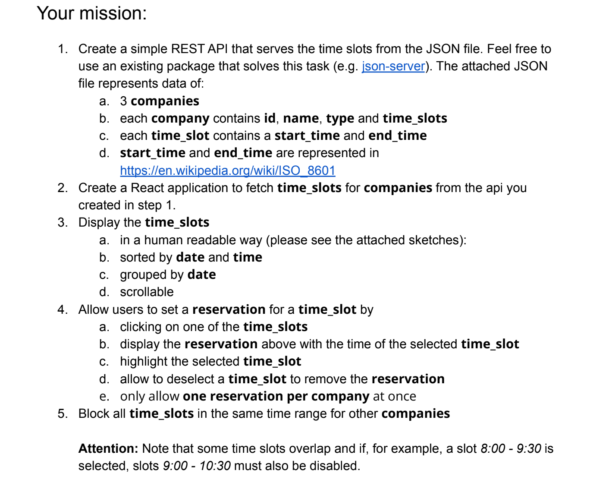
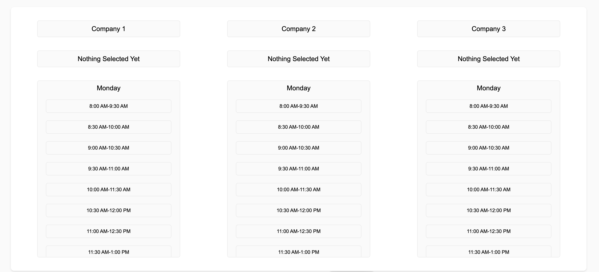

## Task - Dates | Frontend-Exercise

[Alvaro Hernandez](mailto:alvarohernandezassens@gmail.com)

## Proposed Solution

- Setup server
- Setup client with create-react-app
- Create basic component structure and design state workflow
- Setup redux
- Implement state with redux
- Implement styes with styled-components
- Refine logic and fix bugs
- Create tests

## Screenshots

## Assumptions

Once one time slot is selected in one company it will disable the rest of the slots for the same company. Only one slot can be selected for company at the same time.

## Libraries / Tools Used

- JSON server
- React.js
- Create React App for project setup
- Typescript
- Styled Components
- Redux

## Server Setup

To install the dependencies run:

`npm run install`

And to run the app:

`npm run server`

## Frontend Setup

To install the dependencies run in the client folder:

`npm run install`

And to run the app, also in the client folder:

`npm start`

## Running the tests

You can run the unit tests using:

`npm test`

## Future Work

1  Complete unit testing with Jest and react-testing-library until coverage of at least 90%.
2. Improve styling and responsive design.
3. Replace styled-components with plain CSS for better caching.
4. Implement Lazy Loading
